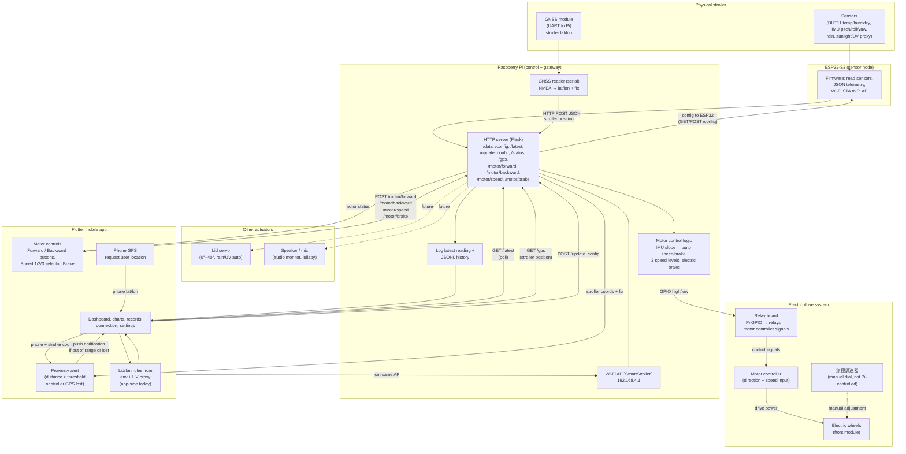
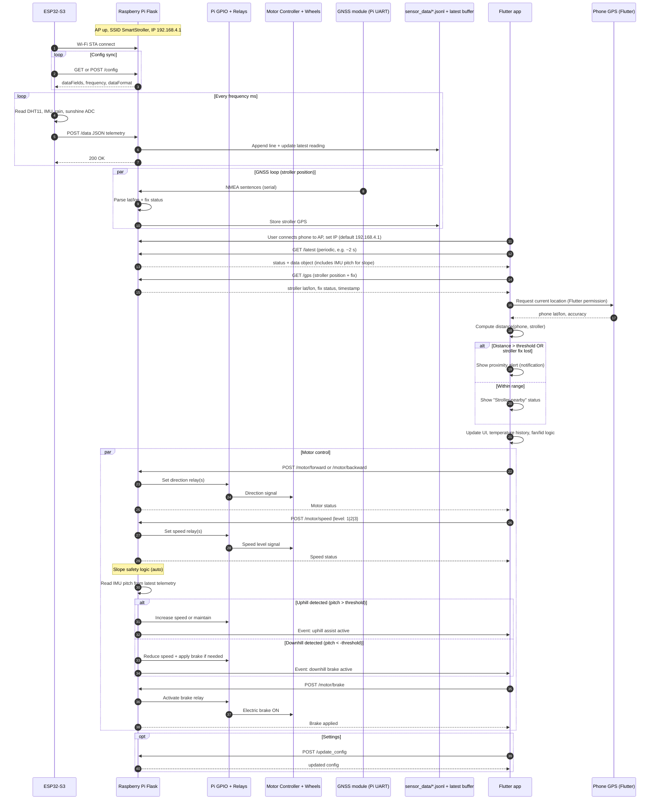
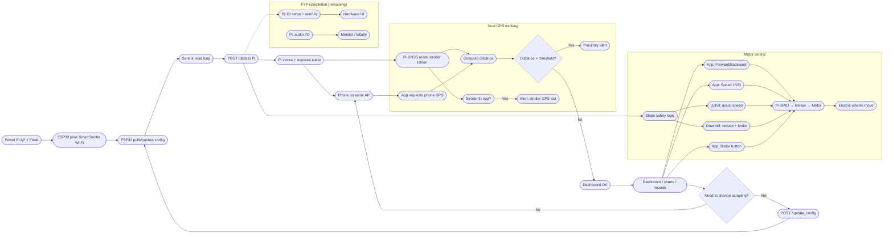
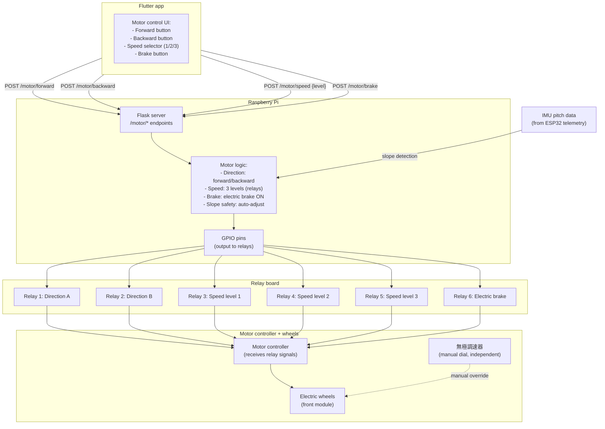
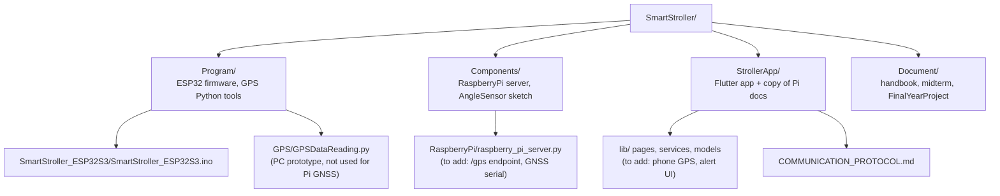

# Smart Stroller — Project flow (Mermaid)

This folder holds flow diagrams for the FYP documentation. They are derived from the interim report (`Document/Midterm/Smart_BB_Car_Interim_Progress_Report.docx`), `StrollerApp/COMMUNICATION_PROTOCOL.md`, and the current repository layout (`Program/`, `Components/`, `StrollerApp/`).

**How to preview:** paste each `mermaid` block into [Mermaid Live Editor](https://mermaid.live) or use a Markdown viewer that renders Mermaid (VS Code extension, GitHub, etc.).

---

## 1. Target system architecture (interim report + design intent)

High-level roles: ESP32 as sensing/telemetry node; Raspberry Pi as gateway (plus GNSS for stroller position) and **motor control node**; Flutter app for monitoring, commands, and phone GPS (parent position). Dashed links are **planned or partially implemented** in code (lid servo on Pi, audio, proximity alert).

---

## 2. Routine: telemetry, motor control, and app monitoring

Concrete loop matching `SmartStroller_ESP32S3.ino`, Pi server, and `WifiService` / dashboard polling. GNSS on Pi provides stroller position; phone GPS provides parent position for proximity alert. Motor control via Pi GPIO → relays → motor controller.

---

## 3. End-to-end operational flow (user + system)

---

## 4. Motor control architecture (detail)

This section expands the motor control subsystem for FYP documentation.

**Motor control endpoints (proposed):**

| Endpoint | Method | Body | Description |
|----------|--------|------|-------------|
| `/motor/forward` | POST | `{}` | Set direction to forward |
| `/motor/backward` | POST | `{}` | Set direction to backward |
| `/motor/speed` | POST | `{"level": 1\|2\|3}` | Set speed level |
| `/motor/brake` | POST | `{}` | Apply electric brake |
| `/motor/status` | GET | — | Get current motor state |

---

## 5. Repository map (for documentation cross-reference)

---

## Notes for your review

1. **Motor control architecture:**
   - Pi GPIO → Relay board → Motor controller → Electric wheels
   - Functions: **Forward/Backward**, **3 speed levels**, **Electric brake**
   - **無極調速器** (stepless speed dial) is **manual-only**, not connected to Pi
   - Slope safety logic on Pi uses IMU pitch from ESP32 telemetry to auto-adjust speed/brake

2. **Motor API endpoints (to implement):**
   - `POST /motor/forward`, `/motor/backward` — direction control
   - `POST /motor/speed {"level": 1|2|3}` — speed selection
   - `POST /motor/brake` — electric brake
   - `GET /motor/status` — current state

3. **Dual GPS architecture:** GNSS module → Pi UART → `/gps` endpoint for **stroller position**; Flutter app → phone GPS permission for **parent position**. App computes distance and shows alert if **distance > threshold** or **stroller GPS fix lost**.

4. **Implementation gaps:**
   - Pi server needs `/gps` route and GNSS NMEA parsing (e.g., via `pyserial`).
   - Pi server needs `/motor/*` routes and GPIO control for relays.
   - Flutter app needs motor control UI and `geolocator` for phone GPS.

5. **IMU naming:** The interim report references MPU9250; the current ESP32 sketch uses **JY901S** over UART for roll/pitch/yaw. The flow is the same; update the diagram labels in your final report if you standardize on one module.

6. **Pi server variants:** A fuller `raspberry_pi_server.py` (with `/latest` and in-memory latest reading) exists under `StrollerApp/SmartStroller/RaspberryPi/`; `Components/RaspberryPi/` may differ slightly—align before demo.

7. **GPS prototype:** `Program/GPS/GPSDataReading.py` is a **standalone PC map viewer**; the FYP uses **GNSS on Pi** instead.

If any box or arrow does not match your demo setup, say which part to change and we can regenerate this file.
